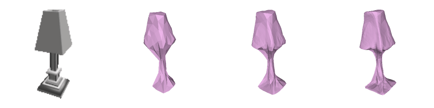
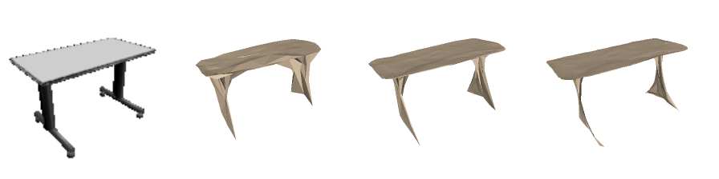
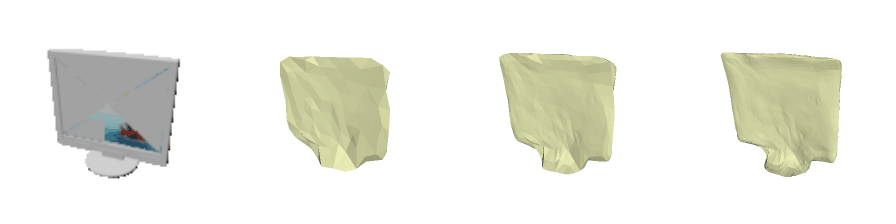

# Pixel2Mesh

This is an implementation of Pixel2Mesh in PyTorch. Besides, we also:

- Provide retrained Pixel2Mesh checkpoints. Besides, the pretrained tensorflow pretrained model provided in [official implementation](https://github.com/nywang16/Pixel2Mesh) is also converted into a PyTorch checkpoint file for convenience.
- Provide a modified version of Pixel2Mesh whose backbone is ResNet instead of VGG.
- Clarify some details in previous implementation and provide a flexible training framework.

**If you have any urgent question or issue, please contact jinkuncao@gmail.com.**


## Get Started

### Environment

Current version only supports training and inference on GPU. It works well under dependencies as follows:

- Ubuntu 16.04 / 18.04
- Python 3.7
- PyTorch 1.1
- CUDA 9.0 (10.0 should also work)
- OpenCV 4.1
- Scipy 1.3
- Scikit-Image 0.15

Some minor dependencies are also needed, for which the latest version provided by conda/pip works well:

> easydict, pyyaml, tensorboardx, trimesh, shapely

Two another steps to prepare the codebase:

1. `git submodule update --init` to get [Neural Renderer](https://github.com/daniilidis-group/neural_renderer) ready.
2. `python setup.py install` in directory [external/chamfer](external/chamfer) and `external/neural_renderer` to compile the modules.

### Datasets

We use [ShapeNet](https://www.shapenet.org/) for model training and evaluation. The official tensorflow implementation provides a subset of ShapeNet for it, you can download it [here](https://drive.google.com/drive/folders/131dH36qXCabym1JjSmEpSQZg4dmZVQid). Extract it and link it to `data_tf` directory as follows. Before that, some meta files [here](https://drive.google.com/file/d/16d9druvCpsjKWsxHmsTD5HSOWiCWtDzo/view?usp=sharing) will help you establish the folder tree, demonstrated as follows.

~~*P.S. In case more data is needed, another larger data package of ShapeNet is also [available](https://drive.google.com/file/d/1Z8gt4HdPujBNFABYrthhau9VZW10WWYe/view). You can extract it and place it in the `data` directory. But this would take much time and needs about 300GB storage.*~~

P.S.S. For the larger data package, we provide a temporal access here on [OneDrive](https://1drv.ms/u/s!AtMVLfbdnqr4nGZjQ8GuPHlEUSg9?e=0dIEbK).

```
datasets/data
├── ellipsoid
│   ├── face1.obj
│   ├── face2.obj
│   ├── face3.obj
│   └── info_ellipsoid.dat
├── pretrained
│   ... (.pth files)
└── shapenet
    ├── data (larger data package, optional)
    │   ├── 02691156
    │   │   └── 3a123ae34379ea6871a70be9f12ce8b0_02.dat
    │   ├── 02828884
    │   └── ...
    ├── data_tf (standard data used in official implementation)
    │   ├── 02691156 (put the folders directly in data_tf)
    │   │   └── 10115655850468db78d106ce0a280f87
    │   ├── 02828884
    │   └── ...
    └── meta
        ...
```

Difference between the two versions of dataset is worth some explanation:

- `data_tf` has images of 137x137 resolution and four channels (RGB + alpha), 175,132 samples for training and 43,783 for evaluation.
- `data` has RGB images of 224x224 resolution with background set all white. It contains altogether 1,050,240 for training and evaluation.

*P.S. We trained model with both datasets and evaluated on both benchmarks. To save time and align our results with the official paper/implementation, we use `data_tf` by default.*

### Usage

#### Configuration

You can modify configuration in a `yml` file for training/evaluation. It overrides dsefault settings in `options.py`. We provide some examples in the `experiments` directory. 

#### Training

```
python entrypoint_train.py --name xxx --options path/to/yaml
```

*P.S. To train on slurm clusters, we also provide settings reference. Refer to [slurm](slurm) folder for details.*

#### Evaluation

```shell
python entrypoint_eval.py --name xxx --options path/to/yml --checkpoint path/to/checkpoint
```

#### Inference

You can do inference on your own images by a simple command:

``` 
python entrypoint_predict.py --options /path/to/yml --checkpoint /path/to/checkpoint --folder /path/to/images
```

*P.S. we only support do training/evaluation/inference with GPU by default.*

## Results

We tested performance of some models. The [official tensorflow implementation](https://github.com/nywang16/Pixel2Mesh) reports much higher performance than claimed in the [original paper](https://arxiv.org/abs/1804.01654) as follows. The results are listed as follows, which is close to that reported in [MeshRCNN](https://arxiv.org/abs/1906.02739).  The original paper evaluates result on simple mean, without considerations of different categories containing different number of samples, while some later papers use weighted-mean. We report results under both two metrics for caution.

<table>
  <thead>
    <tr>
      <th>Checkpoint</th>
      <th>Eval Protocol
      <th>CD</th>
      <th>F1<sup>τ</sup></th>
      <th>F1<sup>2τ</sup></th>
    </tr>
  </thead>
  <tbody>
    <tr>
      <td rowspan=2>Official Pretrained (tensorflow)</td>
      <td>Mean</td>
      <td>0.482</td>
      <td>65.22</td>
      <td>78.80</td>
    </tr>
    <tr>
      <td>Weighted-mean</td>
      <td>0.439</td>
      <td><b>66.56</b></td>
      <td><b>80.17</b></td>
    </tr>
    <tr>
      <td rowspan=2>Migrated Checkpoint</td>
      <td>Mean</td>
      <td>0.498</td>
      <td>64.21</td>
      <td>78.03</td>
    </tr>
    <tr>
      <td>Weighted-mean</td>
      <td>0.451</td>
      <td>65.67</td>
      <td>79.51</td>
    </tr>
    <tr>
      <td rowspan=2>ResNet</td>
      <td>Mean</td>
      <td><b>0.443</b></td>
      <td><b>65.36</b></td>
      <td><b>79.24</b></td>
    </tr>
    <tr>
      <td>Weighted-mean</td>
      <td><b>0.411</b></td>
      <td>66.13</td>
      <td>80.13</td>
    </tr>
  </tbody> 
</table>

*P.S. Due to time limit, the resnet checkpoint has not been trained in detail and sufficiently.*

### Pretrained checkpoints

- **VGG backbone:** The checkpoint converted from official pretrained model  (based on VGG) can be downloaded [here](https://drive.google.com/file/d/1Gk3M4KQekEenG9qQm60OFsxNar0sG8bN/view?usp=sharing). (scripts to migrate tensorflow checkpoints into `.pth` are available in `utils/migrations`. )
- **ResNet backbone:** As we provide another backbone choice of resenet, we also provide a corresponding checkpoint [here](https://drive.google.com/file/d/1pZm_IIWDUDje6gRZHW-GDhx5FCDM2Qg_/view?usp=sharing). 

## Details of Improvement

We explain some improvement of this version of implementation compared with the official version here.

- **Larger batch size:** We support larger batch size on multiple GPUs for training. Since Chamfer distances cannot be calculated if samples in a batch with different ground-truth pointcloud size, "resizing" the pointcloud is necessary. Instead of resampling points, we simply upsample/downsample from the dataset.
- **Better backbone:** We enable replacing VGG by ResNet50 for model backbone. The training progress is more stable and final performance is higher.
- **More stable training:** We do normalization on the deformed sphere, so that it's deformed at location $(0,0,0)$; we use a threshold activation on $z$-axis during projection, so that $z$ will always be positive or negative and never be $0$. These seem not to result in better performance but more stable training loss.

## Demo

Generated mesh samples are provided in [datasets/examples](datasets/examples) from our ResNet model. Three mesh models in a line are deformed from a single ellipsoid mesh with different number of vertices (156 vs 268 vs 2466) as configurated in the original paper. 








## Acknowledgements

Our work is based on the official version of [Pixel2Mesh](https://github.com/nywang16/Pixel2Mesh); Some part of code are borrowed from [a previous PyTorch implementation of Pixel2Mesh](https://github.com/Tong-ZHAO/Pixel2Mesh-Pytorch). The packed files for two version of datasets are also provided by them two. Most codework is done by [Yuge Zhang](https://github.com/ultmaster).
